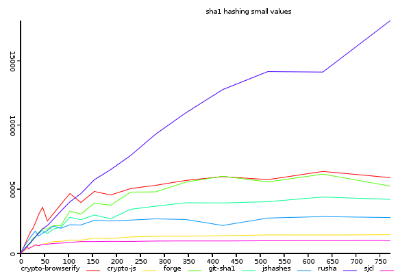
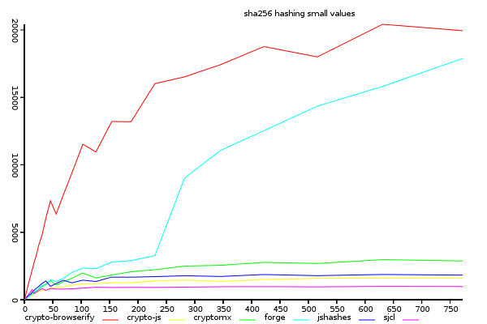

# performance of hashing in various javascript crypto libraries.

Dominic Tarr (Stackvm Research) 2014-01-26

## Abstract

The performance of a cryptography library is not it's most important aspect
(security/correctness is), but performance is still highly important.
If performance is too low, it affects the usability, and so less cryptography
will be used. In this article, I've compared the performance of the sha hashing functions
in several popular javascript crypto libs. These have widly varying perfomance,
and some have non-linear performance characteristics.

## Method

So far, I have benchmarks for measuring hashing performance against input size,
and key deriviation performance (pbkdf2) as the number of iterations are increased.
hashing a "large" file measures throughput, while key deriviation depends on creating many hashes
repeatedly - whether many hashes can be created in succession is quite a different measurement.

Since javascript timers are not very precise, if the time taking to hash is under 100 ms,
the hash is repeated until the elasped time is > 100ms, and the the time taken is adjusted
to `time_taken/repeated_runs`.

All benchmarks where run on a macbook air 11 running archlinux and node@0.10.24

## crypto implementations

* stanford javascript crypto library (sjcl)
* crypto-js
* forge
* crypto-browserify (I am the author of this module)

## Hashing a 0-10MB file

Since each library provides a different api, each api has been wrapped to a function
that takes a buffer, and then converts to a format that the algorithm can process,
and calls the hash function with one buffer.

This is not necessarily fair on some libraries,
but it would be surprising if encoding had more
than a small effect on hashing performance.

### sha1, time taken against input size.

>(y-axis shows total time taken, higher is better)

Every implementation behaves basically linearly with input size,
except that crypto-browserify becomes more efficient once input size
becomes about 2mb. Below 2mb, forge is slightly ahead of crypto-browserify,
and sjcl and crypto-js are significantly slower as file size increases.

### sha1, bytes hashed per millisecond

>(y-axis shows time/input size, lower is better)

When comparing the rate of hashing against input size, the improvement in crypto-browserify's
performance becomes readdily apparent. My suspucion is that the over head of allocating
TypedArrays is what slows down crypto-browserify at low input size.
A future experiment will be to manage TypedArrays with pooling or some such,
to make repeated hashes faster.

It is temping to think of the change in performance as an good thing,
but I think it's better to interpret any departure from linear as
signs of trouble - or at least room for improvement. Although I am very happy
to see that my library is significantly faster than the others at one thing.
Hashing small inputs is very important, since most inputs are probably small.

### sha256, time taken against input size.

>(y-axis shows total time taken, higher is better)

sjcl and crypto-js performance at sha256 seems much the same as for sha1,
but forge is faster than cryto-browserify, which doesn't show any improvement with input size.

### Sha256, time taken against input size.

>(y-axis shows time/input size, lower is better)

forge is clearly faster, and crypto-browserify does not show any improvement.
also note that the performance of both forge and crypto-browserify is over 20k bytes per ms,
about the performance of crypto-browserify's sha1.

An interesting thing here is that crypto-browserify and forge both use very different
binary representations. crypto-browserify uses node.js buffers
(or  [feross/native-buffer-browserify](https://github.com/feross/native-buffer-browserify),
a polyfill ontop of TypedArrays in the browser) where as uses _binary strings_.
Binary Strings is not expected to be faster than TypedArrays, but may have some benefits
in copying from one string to another, since strings are immutable, and there is
the possibility that v8 is doing something clever here.

## key derivation (pbkdf2)

### pbkdf2(sha1), time taken against iterations.

>(y-axis shows total time taken, higher is better)

This graph shows that crypto-js's pbkdf2 has non-linear performance.
something is clearly wrong, as there is no reason this should not be linear.
compared to crypto-js, the other libraries are not even on this scale.

### sha1 pbkdf, iterations per millisecond.

>(y-axis shows time/input size, lower is better)

looking at the iterations per ms, we see that sjcl, which was the slowest on large files,
is the fastest with rapid iterations. This suggests that there is something about the
crypto-browserify and forge implementations which make the hash objects heavy to create,
but efficient once created. If this is correct, they could possibly be improved with pooling,
or some other thing to lighten iterations.

### pbkdf2(sha256), time taken against iterations.

>(y-axis shows total time taken, higher is better)

Again, crytpo-js has non-linear scaling.

### sha256 pbkdf, iterations per millisecond.

>(y-axis shows time/input size, lower is better)

Interestingly, the relative performance of sjcl is even more impressive,
about 4 times greater than sha1 (it's not surprising that sha256 is the default
hash algorithim for sjcl)

## hashing small files (zoomed into bottom left of hashing bytes/ms graphs)

Is sjcl's superiour pbkdf2 performance due to better performance at small values?
If so, we would expect to see the lines cross if we zoomed in on the bottom left corner
of the hash-ops-sha1 and hash-ops-sha256 graphs.

### sha1 on small inputs

>(y-axis shows time/input size, lower is better)

### sha256 on small inputs

>(y-axis shows time/input size, lower is better)

sjcl is _not_ faster at pure hashes in small values, theirfore,
the key to it's performance must be in another aspect of the implementation.

## Future Work

By optimizing for the specifics of a key derivation algorithm
(i.e. writing a fixed size input, instead of a variable one)
it may be possible to improve iterated hash performance significantly.

It will also be worthwile running the benchmarks under different javascript engines.

## Conclusion

the hash algorithms in sjcl, crypto-browserify, and forge, have been optimized for different purposes.
It appears that crypto-js hasn't been optimized, after the correctness of the implementation has been verified.

