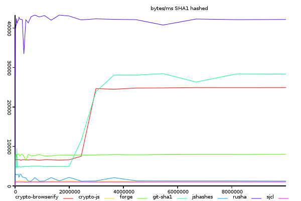
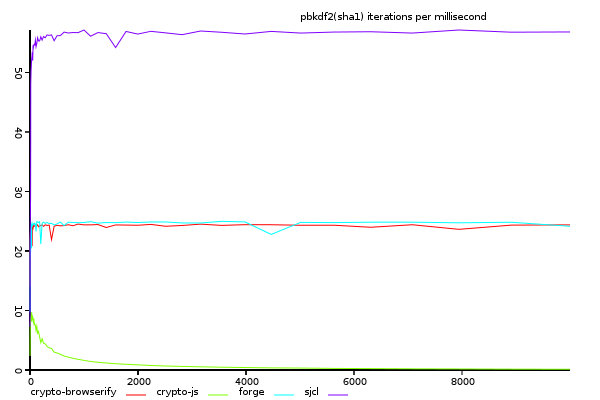
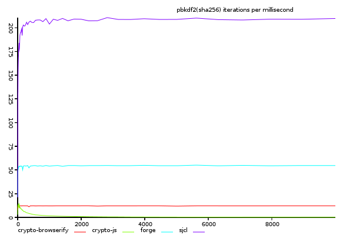
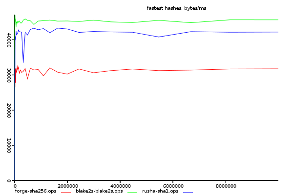

# Performance of Hashing in Javascript Crypto Libraries.

Dominic Tarr (Stackvm Mad Science University) 2014-04-05 (v1.1.2)

## Abstract

The performance of a cryptography library is not its most important consideration,
but performance is still highly important. If performance is too low, it affects the usability,
and so less cryptography will be used. In this article, I've compared the performance of the 
sha hashing functions in several javascript crypto libraries. These have wildly varying performance,
and some have non-linear performance characteristics, and there are a few that have dramatically better perfomance.

## Method

So far, I have benchmarks for measuring hashing performance against input size,
and key derivation performance (pbkdf2) as the number of iterations are increased.
hashing a "large" file measures throughput, while key derivation depends on creating many hashes
repeatedly - whether many hashes can be created in succession is quite a different measurement.

Since javascript timers are not very precise, if the time taking to hash is under 100 ms,
the hash is repeated until the elapsed time is > 100ms, and the the time taken is adjusted
to `time_taken/repeated_runs`.

All benchmarks where run on a macbook air 11 running archlinux and node@0.10.25

## Crypto Libraries Tested

* Stanford javascript crypto library (`sjcl`)
* `crypto-js`
* `forge`
* `crypto-browserify` (I am the author of this module)

The following libraries were also benchmarked,
but they only implemented some of the features tested.

* `crypto-mx` (sha256)
* `git-sha1` (sha1)
* `jshashes` (sha1, sha256)
* `rusha` (sha1)

## Hashing a 0-10MB File

Since each library provides a different API, each api has been wrapped to a function
that takes a buffer, and then converts to a format that the algorithm can process,
and calls the hash function with one buffer.

Since javascript did not originally include a
way to represent binary, some of the older implementations
use arrays of numbers or binary strings. This extra step
is not necessarily fair on them, however it would be 
surprising if encoding had more than a small effect on hashing performance.

### Sha1, Time Taken against Input Size.

>(y-axis shows total time taken, lower is better)

Every implementation behaves basically linearly with input size,
except that `crypto-browserify` and `git-sha1` becomes more efficient once input size
becomes about 2MB. Below 2MB, forge is slightly ahead of crypto-browserify.
`rusha` is consistently the fastest, although at the low end of this graph it's difficult to see by much.
and `sjcl`, `crypto-js`, and `jshashes` are significantly slower as size increases.

### Sha1, Bytes Hashed Per Millisecond

>(y-axis shows size/time, higher is better)

`rusha` stands out impressively ahead of all others. `crypto-browserify` and `git-sha1` are close,
and interestingly make a very similar non-linear step at about 2mb input size. 
Probably this is because they both allocate typed arrays, and that slows them down at low input sizes.
A future experiment will be to manage TypedArrays with pooling, to make repeated hashes faster.

Looking at this graph it appears that `rusha` is certainly the best implementation,
but there is a significant problem - it is not streaming, so you need to buffer the entire
file into memory before hashing it. This is not a problem if you are hashing small files,
or few files at a time. But if you need to hash a large number of files at as they arrive
it will may be slower, due to being unable to process what has arrived inbetween chunks.
This will be the subject of a future experiment.

`crypto-browserify` and `git-sha1` are both capable of streaming.

It is temping to think of the change in performance as an good thing,
but I think it's better to interpret any departure from linear as
signs of trouble - or at least room for improvement.
Hashing small inputs is very important, since most inputs are probably small.

### Sha256, Time Taken Against Input Size.

>(y-axis shows total time taken, lower is better)

sjcl and crypto-js performance at sha256 seems much the same as for sha1,
but forge is faster than crypto-browserify, which doesn't show any improvement with input size.

### Sha256, Time Taken Against Input Size.

>(y-axis shows size/time, higher is better)

`forge` is clearly faster, and `crypto-browserify` does not show any improvement.
also note that the performance of both `forge` and `crypto-browserify` is over 20k bytes per ms,
about the performance of `crypto-browserify`'s sha1.

An interesting thing here is that `crypto-browserify` and `forge` both use very different
binary representations. `crypto-browserify` uses node.js buffers
(or  [feross/buffer](https://github.com/feross/buffer),
a polyfill on top of TypedArrays in the browser) where as `forge` uses _binary strings_.
Binary Strings is not expected to be faster than TypedArrays, but may have some benefits
in copying from one string to another, since strings are immutable, and there is
the possibility that v8 is doing something clever here.

## Key Derivation (pbkdf2)

### Pbkdf2(sha1), Time Taken Against Iterations.

>(y-axis shows total time taken, lower is better)

This graph shows that `crypto-js`'s `pbkdf2` has non-linear performance.
something is clearly wrong, as there is no reason this should not be linear.
compared to `crypto-js`, the other libraries are not even on this scale.

### Pbkdf(sha1), Iterations per Millisecond.

>(y-axis shows size/time, higher is better)

looking at the iterations per ms, we see that `sjcl`, which was the slowest on large files,
is the fastest with rapid iterations. This suggests that there is something about the
`crypto-browserify` and `forge` implementations which make the hash objects heavy to create,
but efficient once created. If this is correct, they could possibly be improved with pooling,
or some other thing to lighten iterations.

`rusha` unfortunately does not have a `pbkdf2` feature, this could easily be added,
and it would be interesting to see if it's performance continues to be impressive.

### Pbkdf2(sha256), Time Taken Against Iterations.

>(y-axis shows total time taken, lower is better)

Again, crypto-js has non-linear scaling.

### Pbkdf2(sha256), Iterations per Millisecond.

>(y-axis shows size/time, higher is better)

Interestingly, the relative performance of sjcl is even more impressive,
about 4 times greater than sha1 (it's not surprising that sha256 is the default
hash algorithm for sjcl)

## Hashing Small Files

> (zoomed into bottom left of the earlier hashing bytes/ms graphs)

Is `sjcl`'s superior pbkdf2 performance due to better performance at small values?
If so, we would expect to see the lines cross if we zoomed in on the bottom left corner
of the bytes-hashed-per-millisecond graphs.

### Sha1 on Small Inputs (bytes/ms)

>(y-axis shows size/time, higher is better)

### Sha256 on Small Inputs (bytes/ms)

>(y-axis shows size/time, higher is better)

`sjcl` is _not_ faster at pure hashes in small values, therefore,
the key to it's performance must be in another aspect of the implementation.

## Comparison of Fastest Hashes.

If you were implementing a new crypto system that must run in the browser,
which is the most performant algorithim to use? In this experiment we compare
the best implementations of different algorithms.

The fastest sha1 implementation is included in the graph, but only for comparison.
Weaknesses have been discovered in sha1, and it should not be used in a new system.

>(y-axis size/time, higher is better)

`blake2s` is a new algorithm (designed specifically to be performant) is
the fastest implementation. `rusha` is close behind it, and then forge's `sha256`
All implementations display nearly completely linear performance.

## Future Work

By optimizing for the specifics of a key derivation algorithm
(i.e. writing a fixed size input, instead of a variable one)
it may be possible to improve iterated hash performance significantly.

It will also be worthwhile running the benchmarks under different javascript engines (browsers)

And prehaps most interesting, would be to construct a realistic benchmark for streaming hashes.
Normally, I have observed that buffering is faster if only one file is processed, however if many
files are to be processed, then you can process part of the file while waiting for the rest to arrive.

## Conclusion

The hash algorithms in sjcl, crypto-browserify, and forge, have been optimized for different purposes.
It appears that crypto-js hasn't been optimized, after the correctness of the implementation has been verified.

## Resources

All resources required to repeat these experiments are available at
[https://github.com/dominictarr/crypto-bench](https://github.com/dominictarr/crypto-bench)
